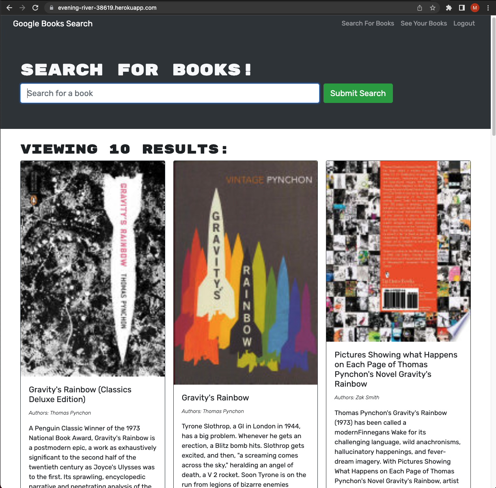

# I_Librarian


## Description:
  
   This application allows users to create accounts, which they can populated with boooks saved from the Google Books API. Saved books are preserved adn can be reaccessed upon login.
   
  ## Table of Contents

* [Installation](#installation)
* [Usage](#usage)
* [Screenshot](#screenshot)
* [Questions](#questions)
  
## Installation
  For local use, retrieve all necessary files from the repository. In the root directory, simply run ```npm install``` to install the required packages.
  
## Usage
  To use this app locally, navigate to the root directory in your terminal. After installing all the necessary packages, run the command ```npm run develop```. The application can also be accessed as a deployed application at https://evening-river-38619.herokuapp.com/. 

## Screenshot
